# chonky-pocket
An almost pocket-sized portable computer!  I wanted a pocket-sized computer... This is not quite it.  It fits in the cargo pocket of one pair of my shorts, but I'm not going to walk around with it like that.  This is better sized for a handbag.  It has a run-all-day sized battery and an ethernet port, as a propper computer should!  

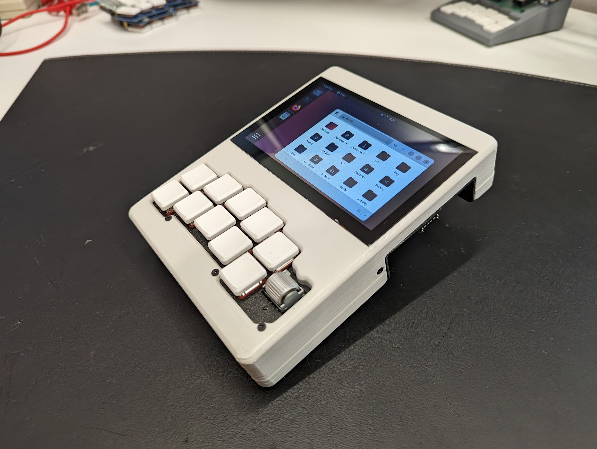

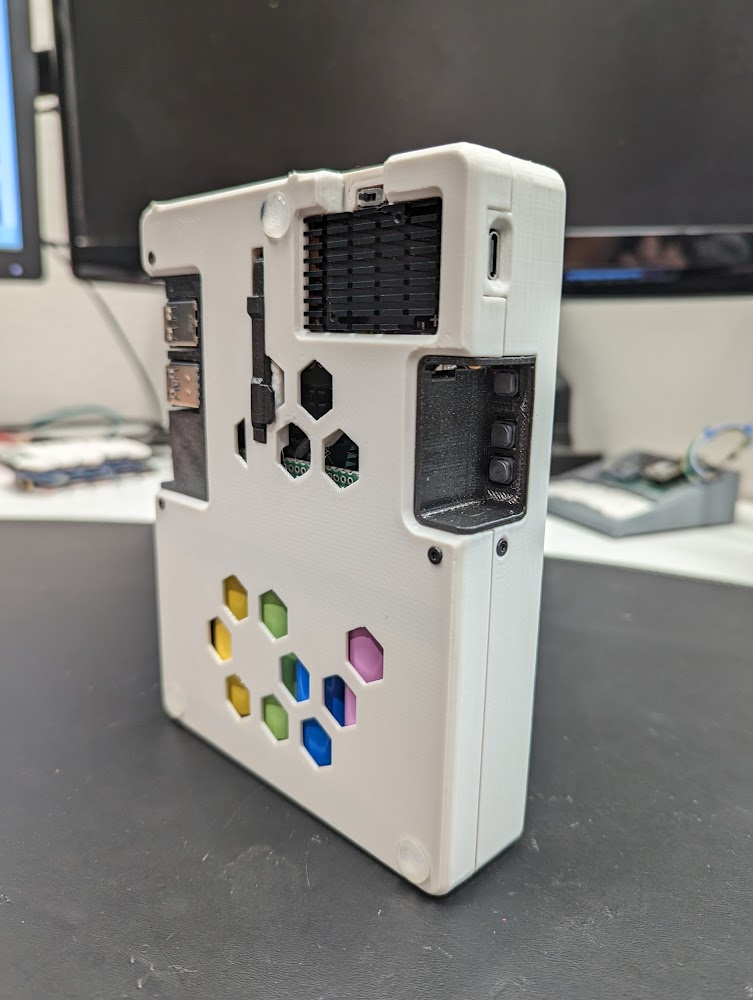  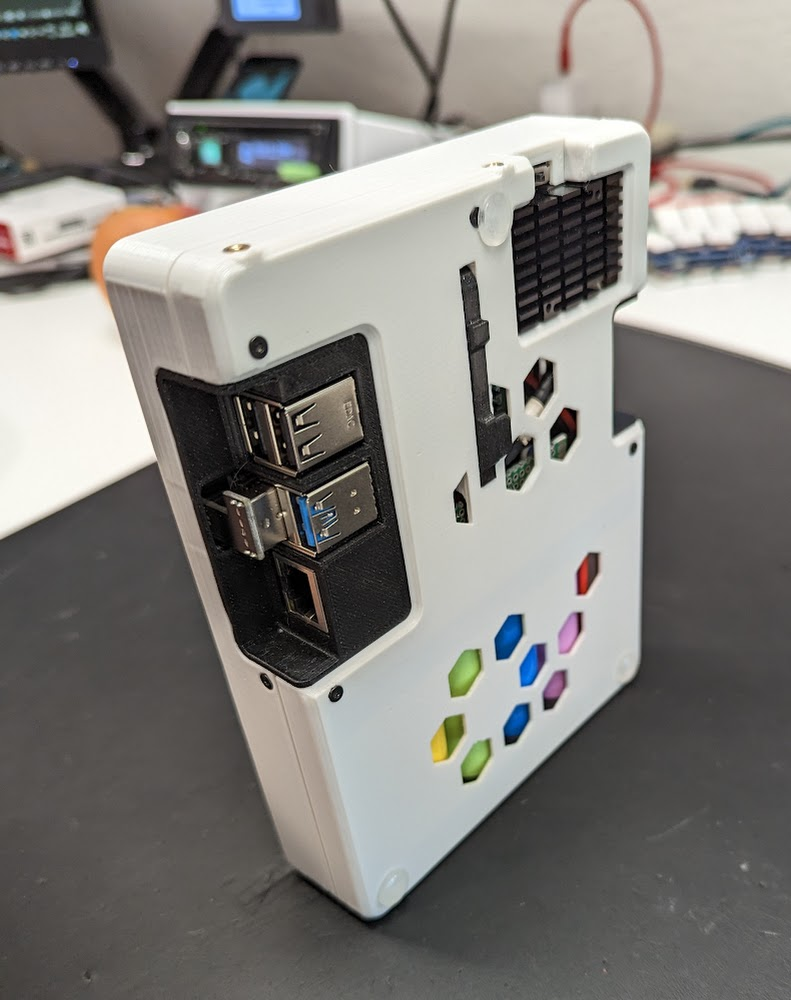  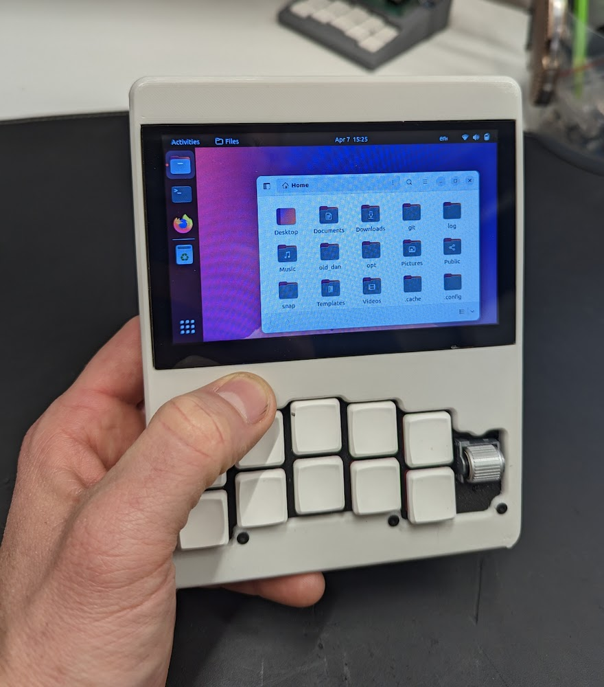  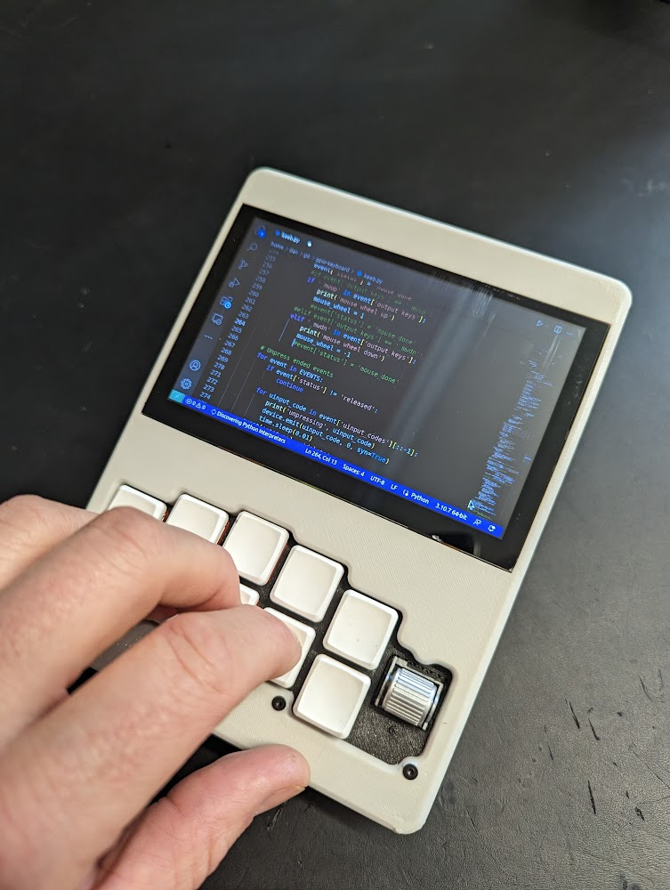

**A few goals for this project:**
* Implement a chording keyboard in software using the raspberry pi gpio pins: https://github.com/a8ksh4/gpio-keyboard
** And explore using the rotary encoder and gyro/accelerometer board for input.
* Get the battery to show up like a laptop battery, reporting state of charg, and charging/discharging status: https://github.com/a8ksh4/rpi-integrated-battery-module
* Learn new techniques in onshape - used a surface to build the angled keyboard from, and extruding multiple parts from the same sketches.
* Polished build - brightness and volume buttons accessible, no power issues, etc that is an incremental improvement from my previous builds.

And in retrospect, a few things I want to include in the next build:
* A display that can turn off when idle and save power - I might still set up a transistor power switch to use gpio to switch the screen on and off, but I'd have to figure out how to integrate this with the OS sleep settings, etc.
* External second hdmi port so I can plug in an external monitor.  I might still work out a good way to fit this in.
* External gpio, i2c, etc pins from the pi for interacting with project devices.  For now, I'll do an external part with a pi pico.
* Pi SD card more accessible.  Or maybe faster usb3 storage?
* Still need to make a smaller build - this probably means using a Pi Zero 2W or trying to strip all the ports off of a Pi 3 or 4 to slim it down, and getting more creative with battery layout to compress things. TBD!

# Case Design and Stl files
All of the current STLs are at https://github.com/a8ksh4/chonky-pocket/tree/main/stl_files.

And you can get the cad designs in OnShape here [in onshape](https://cad.onshape.com/documents/f3ba133b606f4645057c2510/w/c53c420633cef7709b7d72dc/e/867bf425f6e139860c26cd65?renderMode=0&uiState=64308961ce06995598eb5201).  OnShape has free accounts for non-commercial usage and is very nice to work with.  

I try to model stuff like this to minimize use of supports and make sure that all of that visible surfaces are either on the build plate (bottom) or top of the print.  And assembly needs to be considered in the model, too.  Like I can't add features that will block me from sliding in the display.  So there are **pop-in panels** to go around the raspberry pi **ports** and the **volume and brightness buttons** for the display:

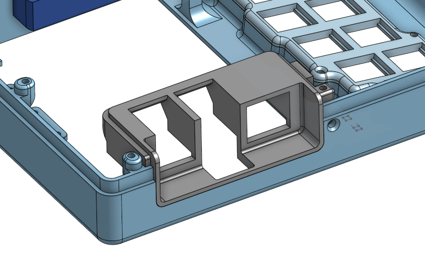  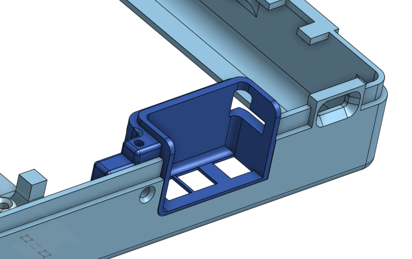

**Snap together case** - The top and bottom of the case sort of friction snap together with a few screws where I can fit them to keep it secure:

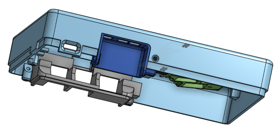  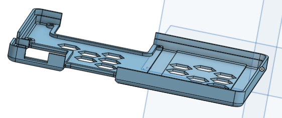

I generally allow for 0.2mm space between 3d printed parts where they touch/connect.  You'll see that in the sketches for the USB and Volume panels where I use the same sketch to extrude an opening in the case as well as extrude the body of the new panel (a separate part).  When a case needs to snap together, 0.1mm or 0.2mm works pretty well.

**Kickstand** - The keyabord is angled at about 10 degrees and there's a kickstand on the back to tilt the whole unit up to help with screen readability.

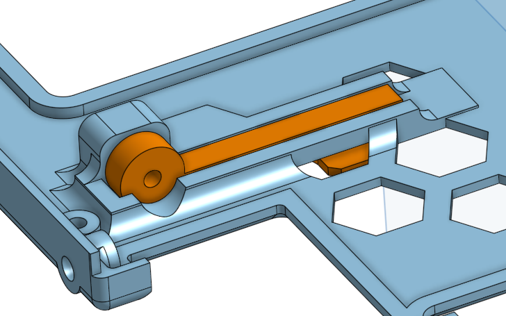  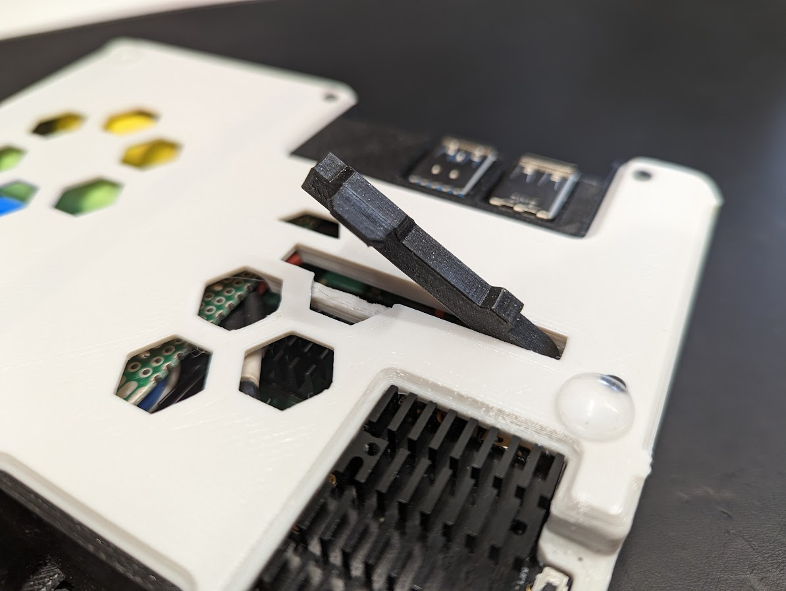

**Accessory Mount** - There are a couple of m3 heat inserts in the top of the unit for mounting any kind of dev board.  I want to be ablet to sit on the couch with with a microcontroller and some parts attached at the top and write code for them without wired dangling all over.

**Power Switch** - It worked out great just to expose the switch built into the power supply at the edge of the case.

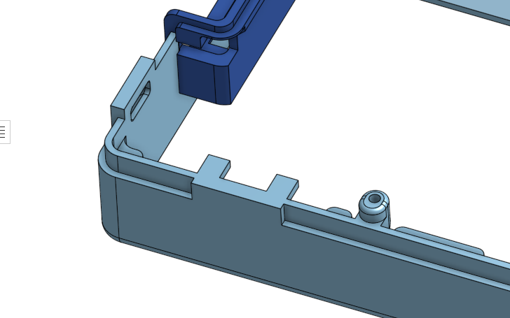  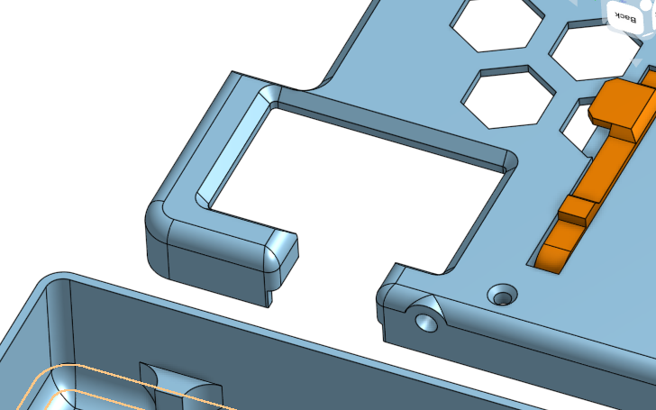  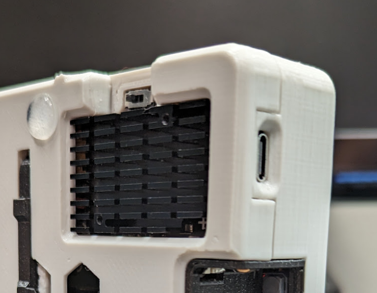

# Keyboard and Input
This build uses a few input methods:
* Mechanical keyboard with chording and mouse emulation.
* Rotary encoder to emulate a mouse wheel (at least)
* Touch screen

It's hard to fit a full-sized keyboard, or even a 40% keyboard into a small build, but one-handed chording keyboards fill the gap where we want a do-anything mechanical keyboard but don't have the space.  This one is based on the [artsey.io](https://www.artsey.io) layout, with a couple extra keys to more derectly access some programming related symbols. 


## Keyboard Wiring
The keyboard and encoder are wired directly to the pi gpio pins.  One wire, the copper zig-zag, goes to ground, and the rest go to digital pins.  Each key gets a digital pin, and the encoder gets three - one for it's clicky button and two for the wheel to sense direction.  With a larger keyboard, we'd have to use matrix wiring with diodes to not use too many gpio pins.

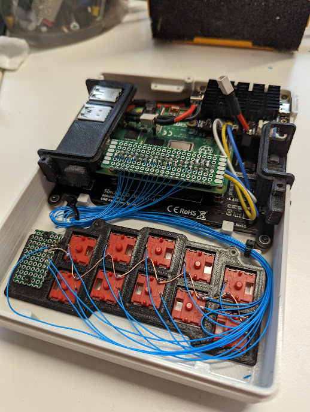

### Encoder
The Encoder has a button built in, sw1 ans sw2, and a rotary encoder with com (common), A, and B.  Com and one of the sw# pins can be connected to ground.  The other sw# pin, A, and B, go to their own gpio pins.  There are encoder libraries that can tell you rotation direction, or you can look at the sequence of pin activation to tell rotation direction.  Each rotaton of the rotary wheel, first one pin will activate, then the other pin, and then they'll both go back to inactive.  The order of activaton indicates direction. Here's the encoder pinout:

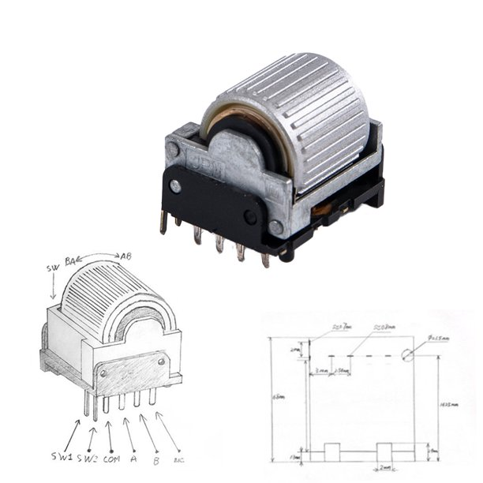

It turns out that if you clip off the plastic nubs and stuff from the bottom of these encoders, you can stuff the pins through a perfboard and use a bit of super-glue to secure them, and then wire one into your project without any custom pcb!

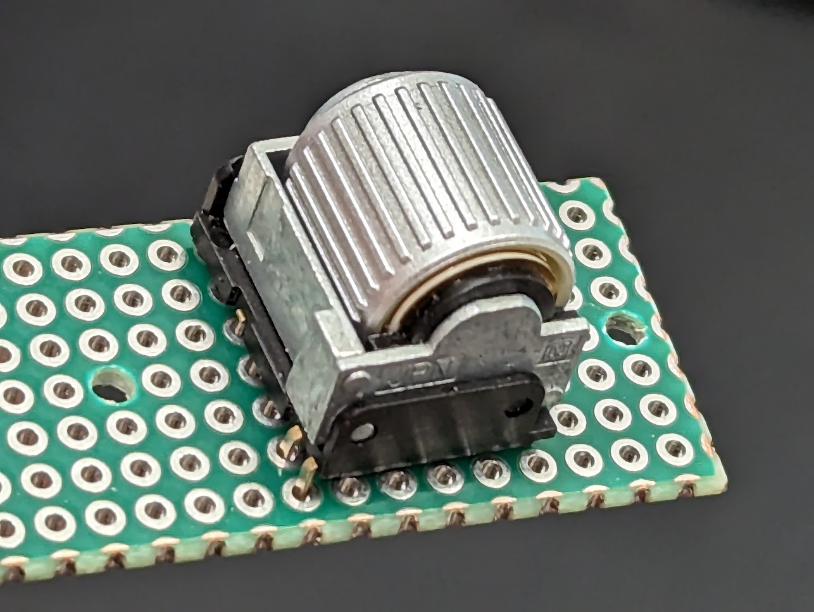  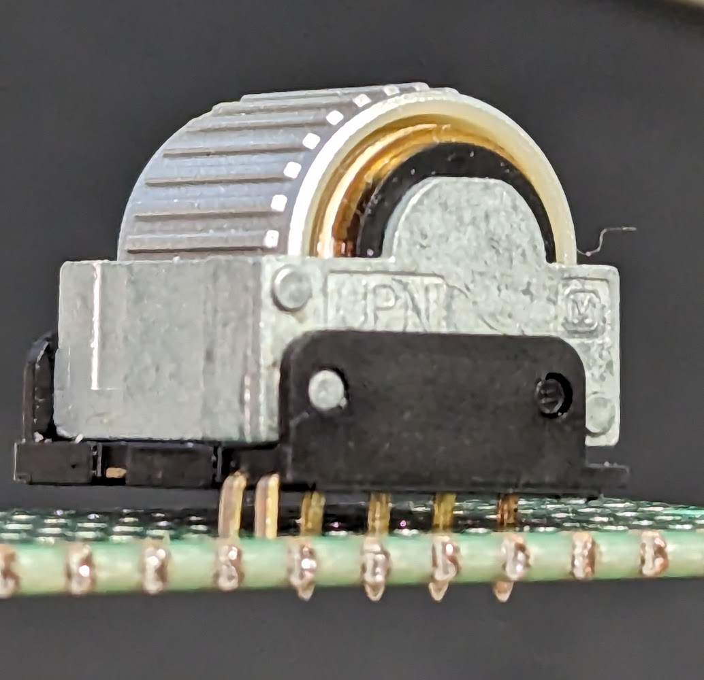

### Gyro/Accelerometer
This is an experiment for sure, using an ITG3205 ADXL345 HMC5883L combo board. I figure I can use either the gyro or the accelerometer for mouse input.  The chip is wired up to the same i2c sda and scl pins as the AR4k uses, as well as ground and 3.3v:

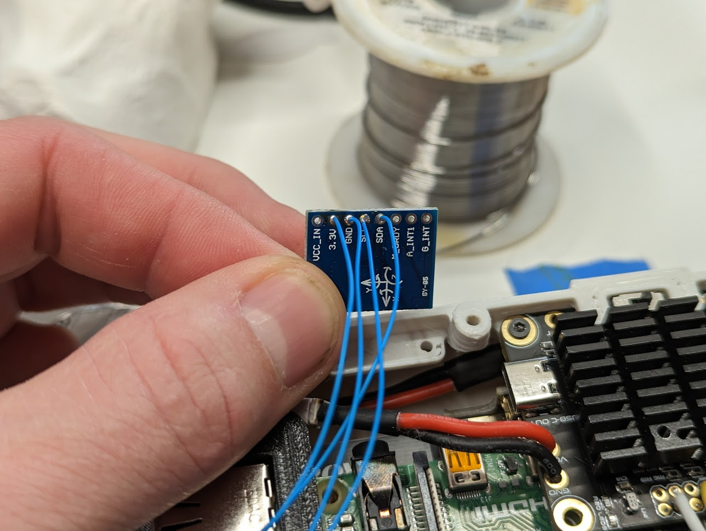  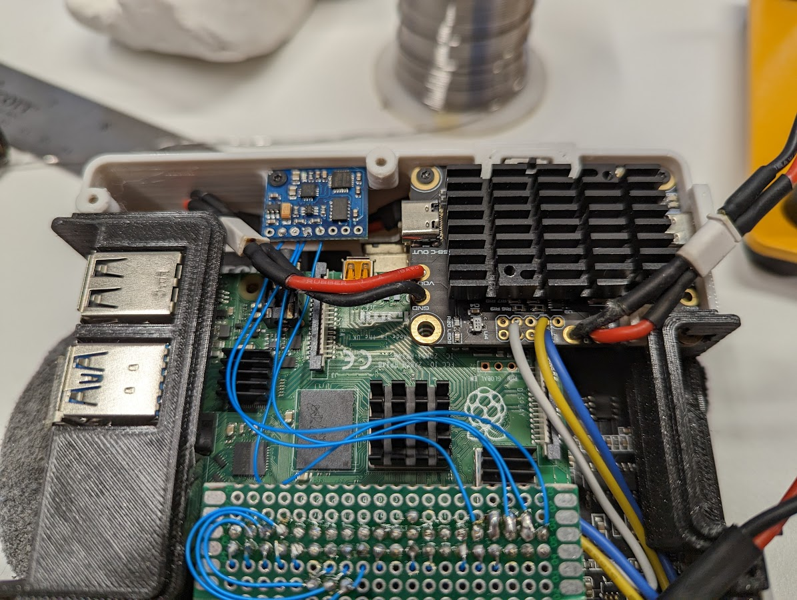

And "i2cdetect -y 1" reports 4 devices now:
```dan@pocket:~$ i2cdetect -y 1
     0  1  2  3  4  5  6  7  8  9  a  b  c  d  e  f
00:                         -- -- -- -- -- -- -- -- 
10: -- -- -- -- -- -- -- -- -- -- -- -- -- -- 1e -- 
20: -- -- -- -- -- -- -- -- -- -- -- -- -- -- -- -- 
30: -- -- -- -- -- -- 36 -- -- -- -- -- -- -- -- -- 
40: -- -- -- -- -- -- -- -- -- -- -- -- -- -- -- -- 
50: -- -- -- 53 -- -- -- -- -- -- -- -- -- -- -- -- 
60: -- -- -- -- -- -- -- -- 68 -- -- -- -- -- -- -- 
70: -- -- -- -- -- -- -- --  ```

* 36 is the MAX17084 Chip in the AR4k
* 68 is the ITG3205 gyro
* ? is the ADXL345 accelerometer
* ? is the HMC5883L 

# Power System
This build uses a few 18650 cells and a charger/boost board (see PSU below) for power.  It can charge while powered on or off and reports the battery state of charge to the OS like a laptop (see Software).  It's no hassle and works well.

## Software
I adapted an existing kernel module and wrote a simple service to query the battery and report level of charge to the OS. This is documented here:  https://github.com/a8ksh4/rpi-integrated-battery-module

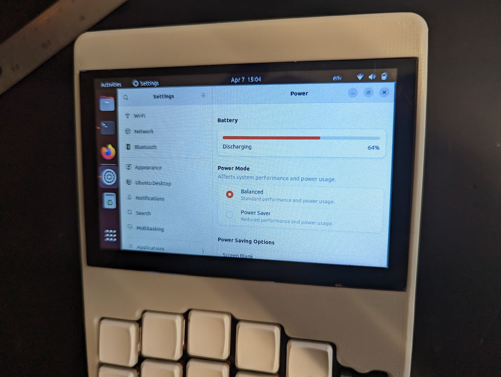

## PSU
This build uses an Amp Ripper 4000 power supply that I was fortunate to get to test pre-release.  This board attaches to the battery and handles charging, as well as boosting the battery voltage (between 4.2v fully charged to ~3v dead) up to 5.1v for the raspberry pi.  It also has an i2c connection for state of charge reporting to the PI - see the above battery modul link.  The AR 4k works really well and I'll definately be buying a couple more for other projects when they're available.  https://www.kickstarter.com/projects/ksd/ampripper-4000-next-gen-battery-charger-and-boost-module

Here's the wiring diaram for the i2c connection:

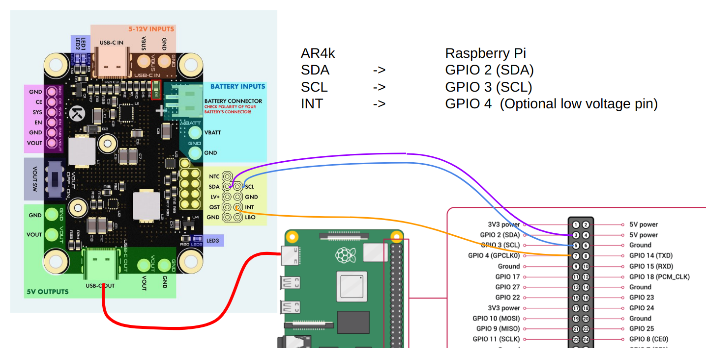

## Battery
The pack is 1s6p, so one cell in series and 6 parallel, with fuses on the posetive terminals of each cell to protect against shorts.  Photos are from initial test-fit to finished test-fit.  Voltage sums in series, and amp hours sum in parallel, so this is a 3.7v pack with about 6 * 3ah -> 18 amp hour. It lasts all day.

        

# Materials List

Misc Stuff
* Raspberry Pi 4: https://rpilocator.com/
* 5 inch hdmi touchscreen with speaker: https://www.amazon.com/gp/product/B08343QX67
* Filament - "Design White" and "Galaxy Black": https://www.printedsolid.com/collections/jessie/ - Note that the galaxy black might be dialectric because of mica content, blocking wifi, so I wouldn't print an entire case out of it. 
* 1/4" Screws: https://www.amazon.com/gp/product/B00GDYNHL6/
* 3/8" Screws: https://www.amazon.com/gp/product/B00GDYNJNM/
* m3 heat inserts: https://www.amazon.com/gp/product/B08BJD3W4X/

Input Stuff:
* Choc Switches: https://www.littlekeyboards.com/collections/keyboard-switches/products/kailh-choc-pro-low-profile-switches?variant=32328459681859
* Keycaps: 
* EVQWGD001 Rotary Encoder: Buy on aliexpress
* Jumper wire for keyboard: https://www.amazon.com/gp/product/B006C4A1WU/
* Breadboard for GPIO connections
* Header for GPIO Connections
* Accelerometer/Gyro Board: https://www.aliexpress.us/item/2251800473351241.html

Power System
* Amp Ripper 4000 PSU: https://www.kickstarter.com/projects/ksd/ampripper-4000-next-gen-battery-charger-and-boost-module
* 6 x 18650 Li-Ion cells
* Nickel strip: https://www.amazon.com/gp/product/B07PQP55CM
* Cell level 18650 Fusing: https://batteryhookup.com/collections/accessories/products/nickel-fuse-2p-wide-continuous-roll-by-the-foot-18650-cell-level-fusing
* 18650 Cell holders: https://batteryhookup.com/collections/accessories/products/18650-cell-holders
* Power Wire: https://www.amazon.com/gp/product/B073RDBW7L

# Outtakes
These builds always take a few print iterations to sort out how things fit together - between errors in measurements, changes to the printer that affect sizes of stuff, and oversights.  

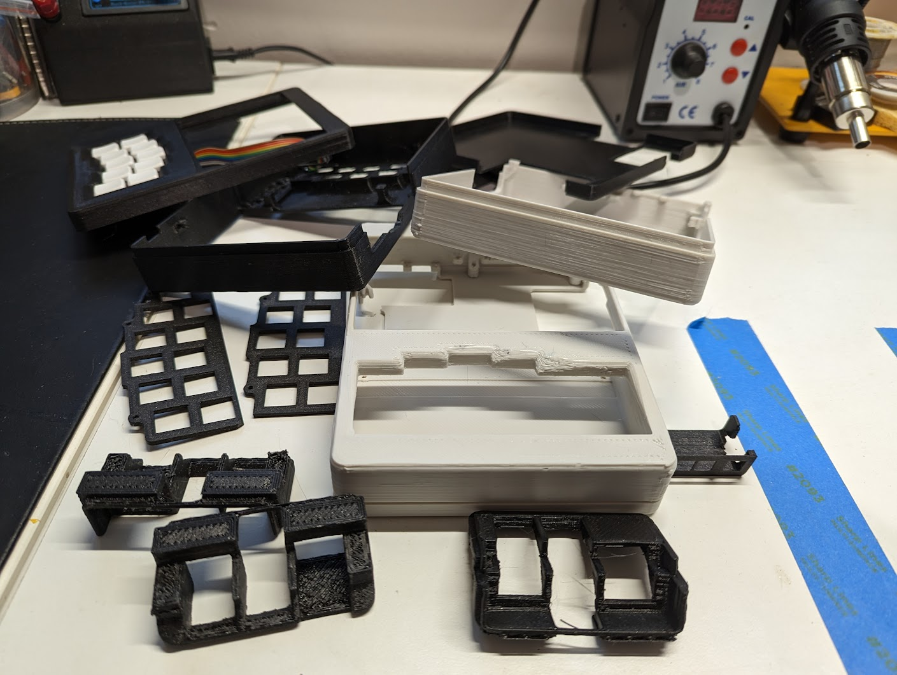

Accidentally wired a few gpio pins that weren't available and had to re-route the wires around.


And I busted a surface mount button for the LCD brighness and had to replace it.  Of coures I lifted the pad wehn I removed the old button... A little solder bridge to the big ground plane fixed it.


