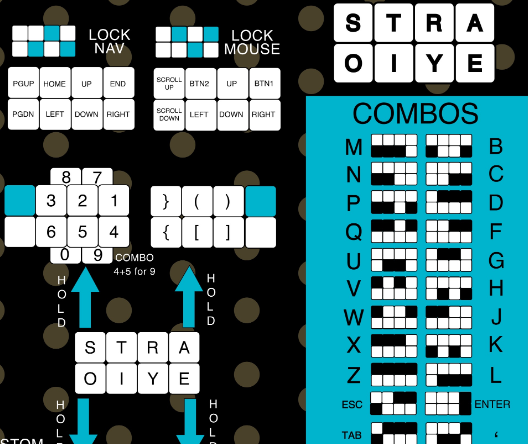
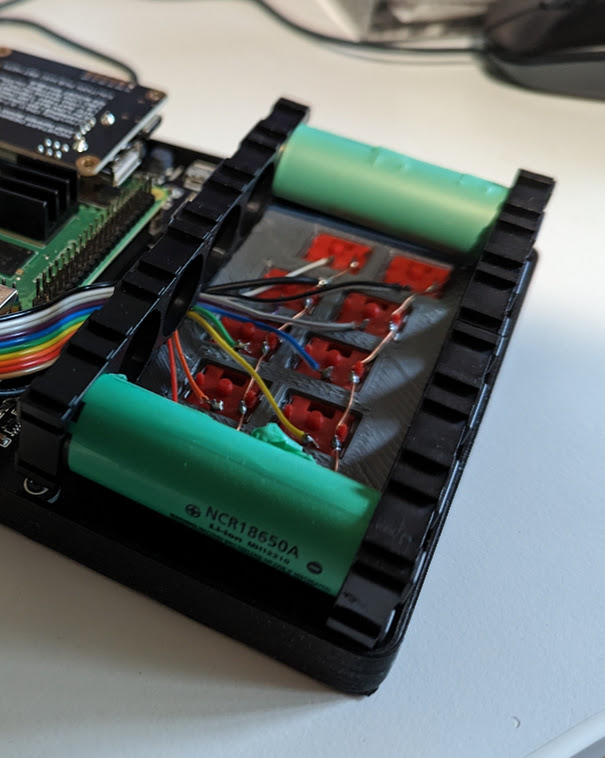
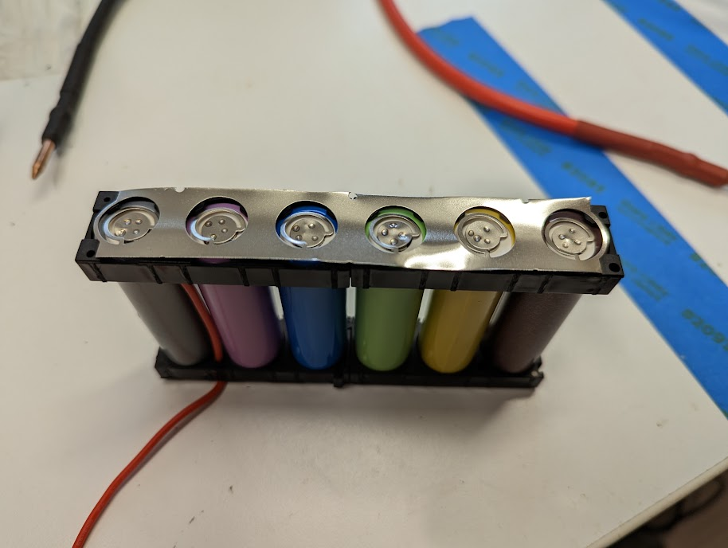
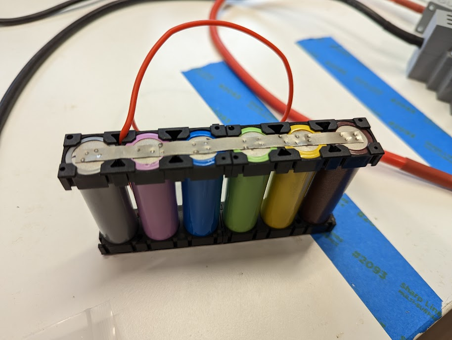
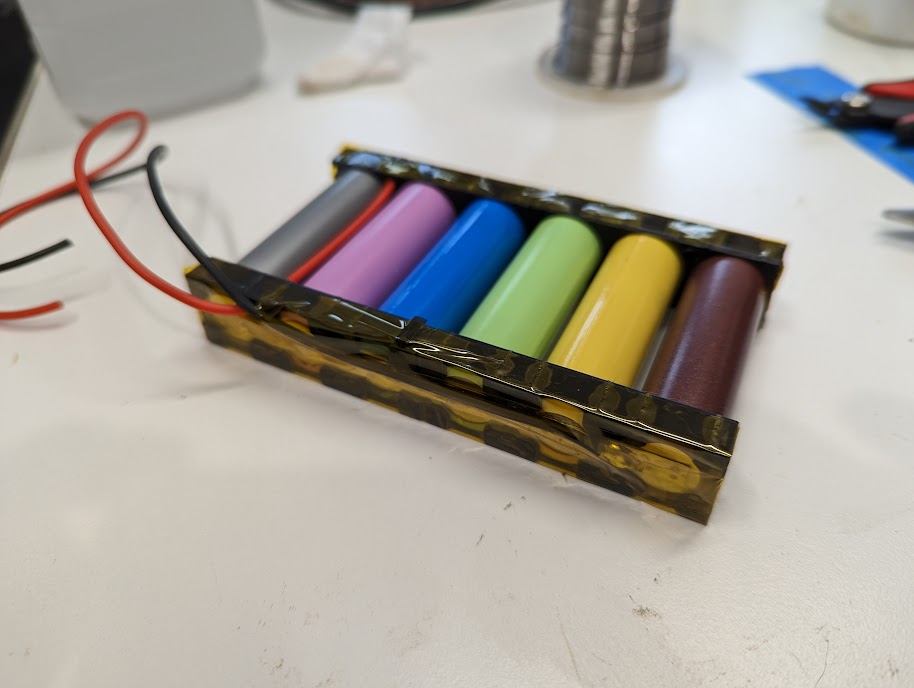
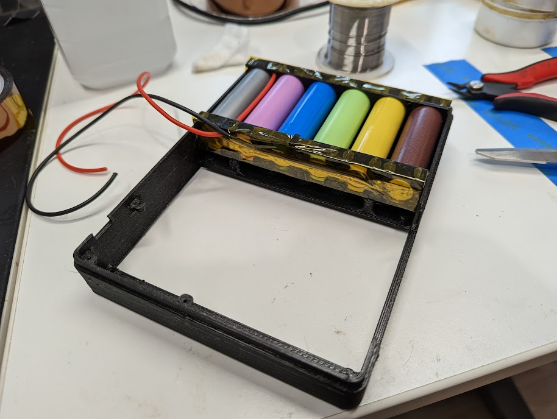
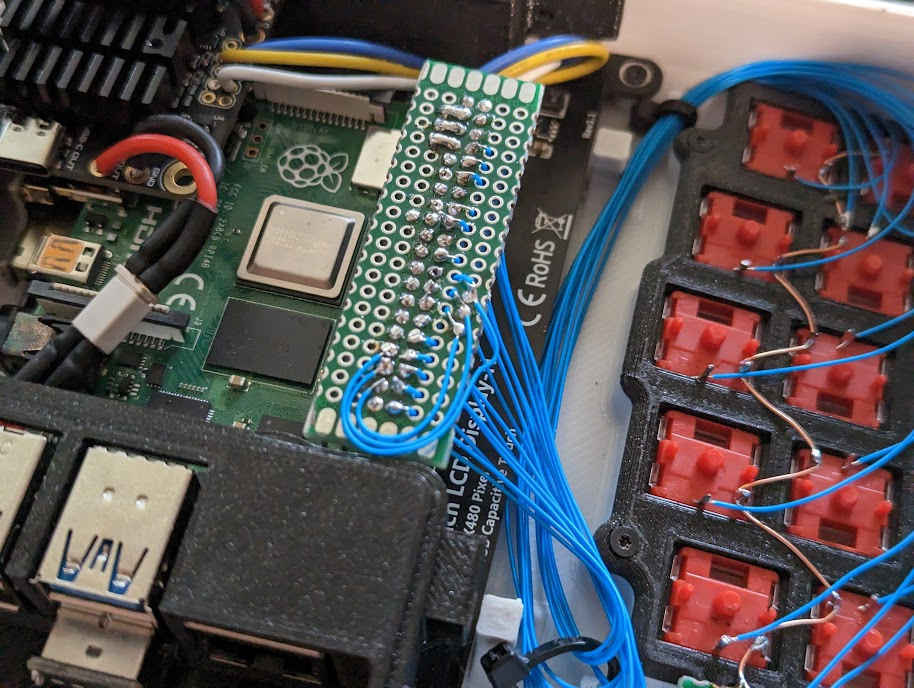
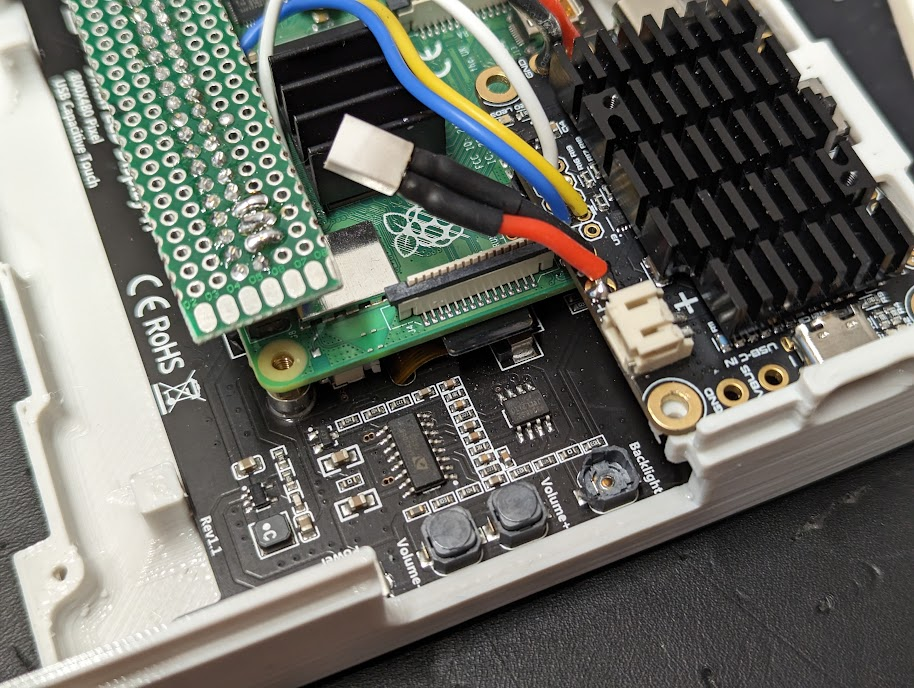
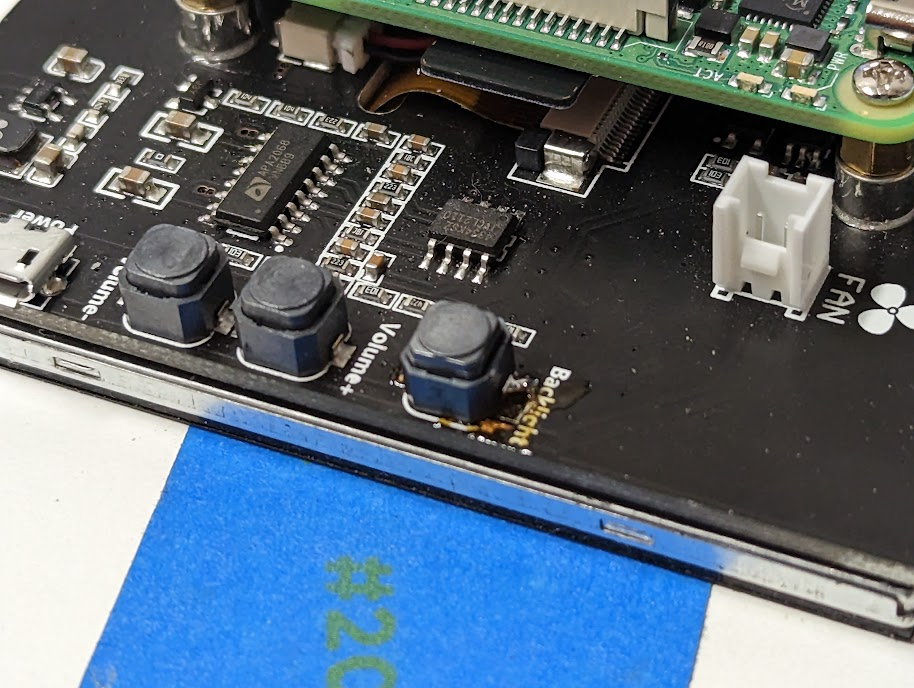

# chonky-pocket
An almost pocket-sized portable computer!  I wanted a pocket-sized computer... This is not quite it.  It fits in the cargo pocket of one pair of my shorts, but I'm not going to walk around with it like that.  This is better sized for a handbag.  It has a run-all-day sized battery and an ethernet port, as a propper computer should!  

A couple of software goals for this project
* Implement a chording keyboard in software using the raspberry pi gpio pins https://github.com/a8ksh4/gpio-keyboard
* Get the battery to show up like a laptop battery https://github.com/a8ksh4/rpi-integrated-battery-module

# Keyboard and Input
This build uses a few input methods:
* Mechanical keyboard with chording and mouse emulation.
* Rotary encoder to emulate a mouse wheel (at least)
* Touch screen

It's hard to fit a full-sized keyboard, or even a 40% keyboard into a small build, but one-handed chording keyboards fill the gap where we want a do-anything mechanical keyboard but don't have the space.  This one is based on the [artsey.io](https://www.artsey.io) layout, with a couple extra keys to more derectly access some programming related symbols. 

## Wiring
The keyboard is wired directly to the gpio pins on the pi with a bit of softwaer to read key presses and pass them to the kernel as characters typed. This was a

# Power System

## Software
## PSU
## Battery
The pack is 1s6p, so one cellin series and 6 parallel, with fuses on the posetive terminals of each cell to protect against shorts.  Photos are from initial test-fit to finished test-fit.

# Chassis Design
# Materials List

Misc Stuff
* Raspberry Pi 4: https://rpilocator.com/
* 5 inch hdmi touchscreen with speaker: https://www.amazon.com/gp/product/B08343QX67
* Filament - "Design White" and "Galaxy Black": https://www.printedsolid.com/collections/jessie/ - Note that the galaxy black might be dialectric because of mica content, blocking wifi, so I wouldn't print an entire case out of it. 
* 1/4" Screws: https://www.amazon.com/gp/product/B00GDYNHL6/
* 3/8" Screws: https://www.amazon.com/gp/product/B00GDYNJNM/

Input Stuff:
* Choc Switches: https://www.littlekeyboards.com/collections/keyboard-switches/products/kailh-choc-pro-low-profile-switches?variant=32328459681859
* EVQWGD001 Rotary Encoder: Buy on aliexpress
* Jumper wire for keyboard: https://www.amazon.com/gp/product/B006C4A1WU/
* Breadboard for GPIO connections
* Header for GPIO Connections

Power System
* Amp Ripper 4000 PSU: https://www.kickstarter.com/projects/ksd/ampripper-4000-next-gen-battery-charger-and-boost-module
* 6 x 18650 Li-Ion cells
* Nickel strip: https://www.amazon.com/gp/product/B07PQP55CM
* Cell level 18650 Fusing: https://batteryhookup.com/collections/accessories/products/nickel-fuse-2p-wide-continuous-roll-by-the-foot-18650-cell-level-fusing
* 18650 Cell holders: https://batteryhookup.com/collections/accessories/products/18650-cell-holders
* Power Wire: https://www.amazon.com/gp/product/B073RDBW7L

# Outtakes
These builds always take a few print iterations to sort out how things fit together - between errors in measurements, changes to the printer that affect sizes of stuff, and oversights.  

Accidentally wired a few gpio pins that weren't available and had to re-route the wires around.

And I busted a surface mount button for the LCD brighness and had to replace it.  Of coures I lifted the pad wehn I removed the old button... A little solder bridge to the big ground plane fixed it.

